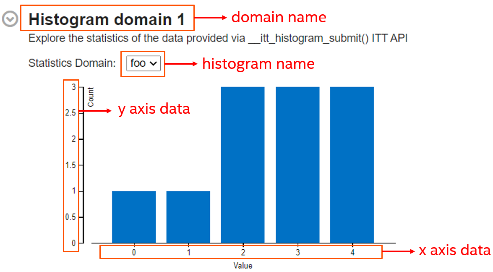

.. _histogram-api:

Histogram API
=============

Use the Histogram API to define histograms that display arbitrary data
in histogram form in Intel® VTune™ Profiler.

The Histogram API enables you to define custom histogram graphs in your
code to display arbitrary data of your choice in VTune Profiler.

Histograms can be especially useful for showing statistics that can be
split by individual units for cross-comparison.

For example, you can use this API in your workload to:

-  Track load distribution
-  Track resource utilization
-  Identify oversubscribed or underutilized worker nodes

Any histogram instance can be accessed by any thread in the process,
regardless of which thread created the histogram. The Histogram API call
is thread-safe.

.. note::

   By default, Histogram API data collection and visualization are
   available in the `Input and Output
   analysis <input-and-output-analysis.html>`__ only. To
   see the histogram in the result of other analysis types, `create a
   custom analysis <custom-analysis.html>`__
   based on the pre-defined analysis type you are interested in, and
   enable the **Analyze user histogram** checkbox in the `custom
   analysis options <custom-analysis-options.html>`__.

Define and Create Histogram
---------------------------

Before creating the histogram, an `ITT API
Domain <domain-api.html>`__ must be
created. The pointer to this domain is then passed to the primitive.

The domain name provides a heading for the histogram section on the
**Summary** tab of VTune Profiler result.

One domain can combine any number of histograms. However, the name of
the histogram must be unique within the same domain.

**Parameters of the primitives:**

.. list-table:: 
   :header-rows: 0

   * -  [in]
     -  ``domain``
     -     Domain controlling the call    
   * -  [in]
     -  ``name``
     -     Histogram name    
   * -  [in]
     -  ``x_axis_type``
     -     Type of X axis data    
   * -  [in]
     -  ``y_axis_type``
     -     Type of Y axis data    

.. container:: fignone
   :name: GUID-788CEBA6-9355-4E6D-ADF7-9ED7BD8441A1

   |image1|

**Primitives:**

.. list-table:: 
   :header-rows: 0

   * -  Use This Primitive
     -  To Do This
   * -  ``__itt_histogram* _itt_histogram_create(__itt_domain* domain, const char* name, __itt_metadata_type x_axis_type, __itt_metadata_type y_axis_type);``
     -     Create a histogram instance with the specified domain, name, and data type on Linux\* and Android\* OS.    
   * -  ``__itt_histogram* _itt_histogram_createA(__itt_domain* domain, const char* name, __itt_metadata_type x_axis_type, __itt_metadata_type y_axis_type);``
     -     Create a histogram instance with the specified domain, name, and data type on Windows\* OS for ASCII strings (``char``).    
   * -  ``__itt_histogram* _itt_histogram_createW(__itt_domain* domain, const wchar_t* name, __itt_metadata_type x_axis_type, __itt_metadata_type y_axis_type);``
     -      Create a histogram instance with the specified domain, name, and data type on Windows\* OS for UNICODE strings (``wchar_t``).    

Submit Data to Histogram
------------------------

**Parameters of the primitives:**

.. list-table:: 
   :header-rows: 0

   * -  [in]
     -  ``histogram``
     -     Histogram instance to submit data to    
   * -  [in]
     -  ``length``
     -     Number of elements in submitted axis data array    
   * -  [in]
     -  ``x_axis_data``
     -     Array containing X axis data (may be ``NULL``).       If ``x_axis_data`` is ``NULL``, VTune Profiler uses the indices of the ``y_axis_data`` array.    
   * -  [in]
     -  ``y_axis_data``
     -     Array containing Y axis data.    

**Primitives:**

.. list-table:: 
   :header-rows: 0

   * -  Use This Primitive
     -  To Do This
   * -  ``void _itt_histogram_submit(__itt_histogram* histogram, size_t length, void* x_axis_data, void* y_axis_data);``
     -     Submit user statistics for the selected histogram instance.       Array data for the Y-axis is mapped to array data for the X-axis, similar to coordinates of a point on a 2D plane.       Data submitted during workload run is summarized into one common histogram for all calls of this primitive.       It is recommended to determine an efficient interval between data submissions to lower collection overhead.    

Usage Example
-------------

The following example creates a histogram to store worker thread
statistics:

.. code:: cpp

   #include "ittnotify.h"
   #include "ittnotify_types.h"

   void submit_stats()
   {
       // Create domain
       __itt_domain* domain = __itt_domain_create("Histogram statistics domain");

       // Create histogram
       __itt_histogram* histogram = __itt_histogram_create(domain, "Worker TID 13454", __itt_metadata_u64, __itt_metadata_u64);

       // Fill the statistics arrays with profiling data:
       uint64_t* x_stats, y_stats;
       size_t array_size;
       get_worker_stats(x_stats, y_stats, array_size);

       // Submit histogram statistics:
       __itt_histogram_submit(histogram, array_size, x_stats, y_stats);
   }

